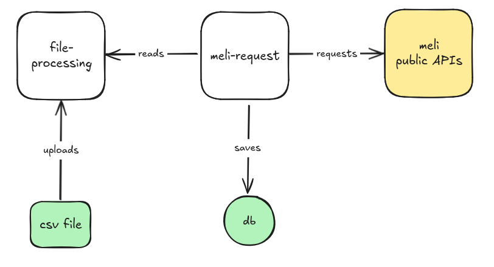

MeLi Challenge
==============

Monorepo con una solución al reto backend de mercado libre.

🧰 Tech Stack
-------------

- nodejs
- docker
- docker compose

🚀 Despliegue
-------------

1. Ejecutar el comando `make start`
2. Verificar que los contenedores `file-processing` y `meli-request` estén disponibles.
3. Ejecutar el comando `curl http:/127.0.0.1:3333/file/data.csv`

👨🏾‍💻 Arquitectura
---------------

Este monorepo consta de los siguientes paquetes:

1. `file-processing`: proyecto para leer un archivo .csv y exponer su contenido.
2. `meli-request`: proyecto para consumir los datos expuestos en el `file-processing`, hacer peticiones a las APIs públicas de mercado libre y guardar el contenido en una base de datos.

El siguiente diagrama representa la comunicación entre los paquetes.

