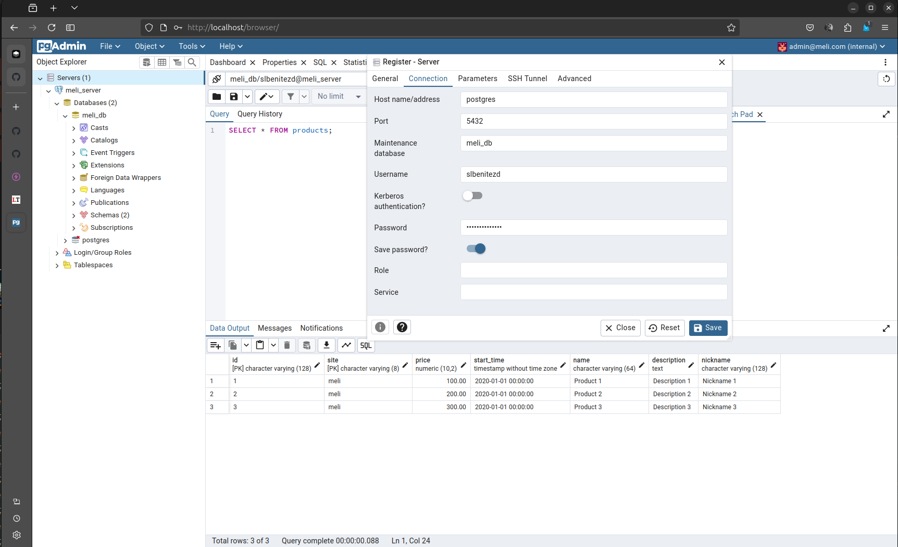

MeLi Challenge
==============

Monorepo con una solución al reto backend de mercado libre.

🧰 Tech Stack
-------------

- [nodejs](https://nodejs.org/en)
- [docker](https://www.docker.com/): sistema operativo para contenedores
- [docker compose](https://docs.docker.com/compose/): herramienta para definir aplicaciones con multiples contenedores.
- [effect](https://effect.website/): un framework por construir aplicaciones con TypeScript. 

⚠️ Aviso
-------

> Actualmente [effect](https://effect.website/) es un ecosistema extenso con partes estables y otras en construcción. Su comunidad es limitada y la mayoría de sus usos se reflejan en un contexto teórico, ya que su aprendizaje es complicado. La misma comunidad recomienda que para reducir la complejidad de effect, lo mejor es empezar a utilizarlo. En este monorepo decidí sacrificar funcionalidad para favorecer claridad en el modelo que opte para solucionar el reto, ya que considero que uno de los beneficios de los sistemas de efectos dar mayor legibilidad en el modelado de la solución de problemas.

👨🏾‍💻 Arquitectura
---------------

Este monorepo consta de los siguientes paquetes:

1. `file-processing`: proyecto para leer un archivo .csv y exponer su contenido.
2. `meli-request`: proyecto para consumir los datos expuestos en el `file-processing`, hacer peticiones a las APIs públicas de mercado libre y guardar el contenido en una base de datos.

El siguiente diagrama representa la comunicación entre los paquetes.

<!---->

En los archivos `README.md` de cada paquete se explica detalladamente las decisiones de arquitectura tomadas sobre el reto.

🧞 Comandos
-----------

Estos comandos se ejecutan en el directorio raíz del proyecto `meli-challenge`.

| Command                    | Action                                           |
| :------------------------- | :----------------------------------------------- |
| `pnpm install`             | Instalar las dependencias                        |
| `docker compose up`        | Carga el contenedor de postgres con la base de datos `meli_db` y una imagen de pg-admin en http://localhost:80 |

La siguiente imagen muestra la configuración del servidor en pg-admin para conectarse a postgres.

