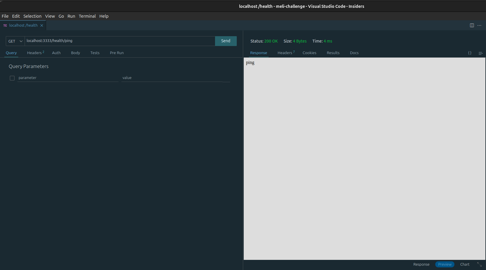
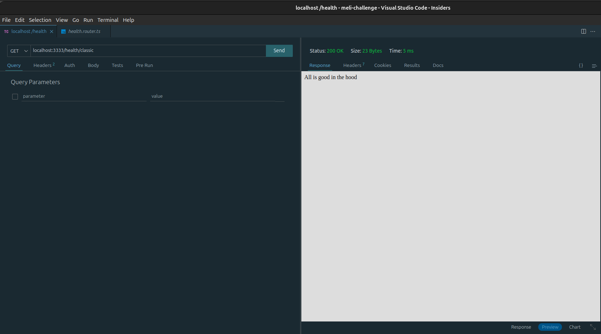
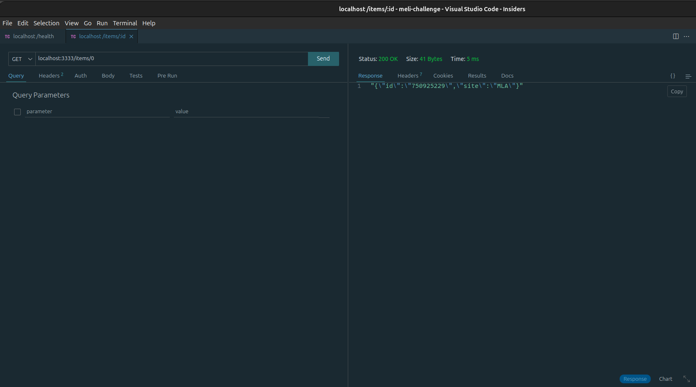
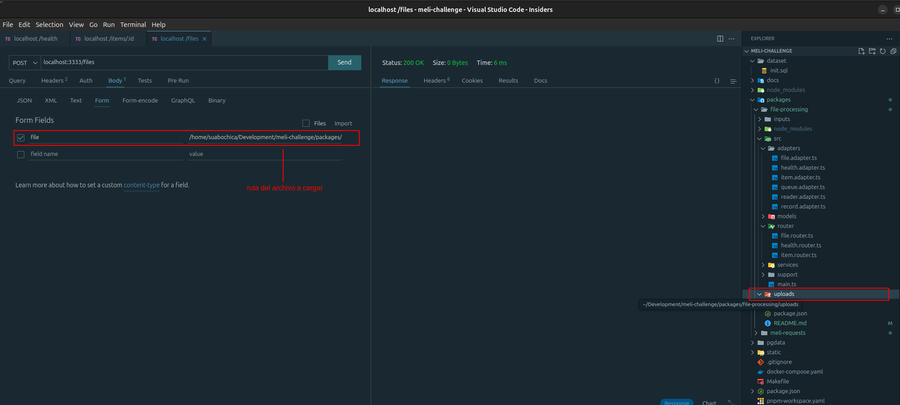

🗄️ File Processing
==================

Paquete que procesa un archivo `.csv`, recupera su contenido y lo expone a través de un concepto de [Colas](https://effect.website/docs/guides/concurrency/queue) definido por effect para que sea consumido por el paquete `meli-requests`

🧰 Tech Stack
-------------

- [effect v3.5.6](https://www.npmjs.com/package/effect):  framework de TypeScript que provee un sistema de efectos funcional completo, inspirado en [ZIO](https://zio.dev/) para Scala.
- [express v4.19.2](https://www.npmjs.com/package/express): framework web para Node.js
- [@effect/platform v0.62.2](https://www.npmjs.com/package/@effect/platform): biblioteca diseñada para crear abstracciones independientes a plataformas como Node.js, Bun y navegadores
- [@effect/platform-node v.057.2](https://www.npmjs.com/package/@effect/platform-node)
- [multer](https://github.com/expressjs/multer/blob/master/doc/README-es.md): middleware para el manejo habilitar la carga de archivos a través `multipart/form-data`

📁 Estructura del proyecto
--------------------------

- *adapters*: carpeta con las implementaciones de las interfaces de los puntos de entrada.
- *models*: carpeta en donde se definen las unidades que juegan el rol de las entidades.
- *router*: carpeta en donde se específican las rutas que vamos a exponer con express.
- *services*: carpeta con los puntos de entrada del paquete (e.g., el archivo `.csv` y el `POST endpoint`)
- *support*: carpeta con utilidaes transversales para el proyecto.

La relación entre las carpetas es una secuencia como ilustra el siguiente diagrama:

<!--[sequence](../../static/diagrams/01-sequence.puml)-->

🔀 Endpoints
------------

A continuación se listan los endpoints expuestos por este paquete, unos con fines teóricos para entendimiento de effect y otros para propósitos del reto acompañados con capturas de pantallas [Thunder Client](https://www.thunderclient.com/).

Health

- `GET health/ping`, para hacer un ping sobre el servidor HTTP.

- `GET health/classic`, para hacer una revisión de estado del servidor HTTP clásico.

Items

- `GET items/id/0` retorna un item definido por el adaptador `RecordAdapter`. Sus fines son de pruebas sobre el servidor HTTP.

Files

- `POST files/fileupload`, crea la carpeta `uploads` para almacenar el archivo que se envía en el `multipart/form-data` de la petición. Por manejo de capas en efecto, acualmente se crea la carpeta sin el archivo adjunto a la petición POST.

🤓 Reader
---------

Una vez cargado el archivo en la carpeta `uploads` se utilizó el [FileSystem](https://effect-ts.github.io/effect/platform/FileSystem.ts.html) del paquete `@effect/platform`. Lo interesante de usar este módulo es que hablita la posibilidad de hacer diferentes tipos de lecturas sobre el archivo:

- `readFileString: (path: string, encoding?: string) => Effect.Effect<string, PlatformError>`: para leer los contenidos de un archivo.
- `stream: (path: string, options?: StreamOptions) => Stream<Uint8Array, PlatformError>`:  habilida la lectura del archivo por chunks.

Es interesante tener esta flexibiilidad ya que para archivos pequeños se podría utilizar `readFileString` y para archivos pesados se utilizaria `stream`.

💊 Queue
---------

Con el archivo leído, Se usa un sistema de colas con el módulo [Queue](https://effect.website/docs/guides/concurrency/queue) de Effect. La responsabilidad del `file-processing` es enviar a la cola el contenido del archivo leído. Posteriormente, este contenido será recuperado por `meli-request`.

Esta pendiente investigar si con Effect se puede compartir la misma cola entre dos paqueted diferentes. De lo contrario, recomendaría usar [kafka](https://kafka.apache.org/) y establecer el canal entre el emisor y el receptor a través de un tópico.

⚠️ Aviso
-------

> Actualmente [effect](https://effect.website/) es un ecosistema extenso con partes estables y otras en construcción. Su comunidad es limitada y la mayoría de sus usos se reflejan en un contexto teórico, ya que su aprendizaje es complicado. La misma comunidad recomienda que para reducir la complejidad de effect, lo mejor es empezar a utilizarlo. En este monorepo decidí sacrificar funcionalidad para favorecer claridad en el modelo que opte para solucionar el reto, ya que considero que uno de los beneficios de los sistemas de efectos dar mayor legibilidad en el modelado de la solución de problemas.

🧞 Comandos
-----------

Estos comandos se ejecutan en el directorio raíz del paquete `file-processing` . i.e., `meli-challenge/packages/file-processing`

| Command                    | Action                                           |
| :------------------------- | :----------------------------------------------- |
| `pnpm install`             | Instalar las dependencias                        |
| `pnpm run dev`             | Comienza el programa para habilitar los endpoints|
| `pnpm run dev:reader`      | Comienza un programa que lee el .csv con effect y muestra su contenido en consola|

Queda pendiente integrar el `main.reader.ts` y el adaptador de la cola al `main.ts`. Para ello, es importante aplicar lo expuesto en el [manejo de capas](https://effect.website/docs/guides/context-management/layers) de Effect.
